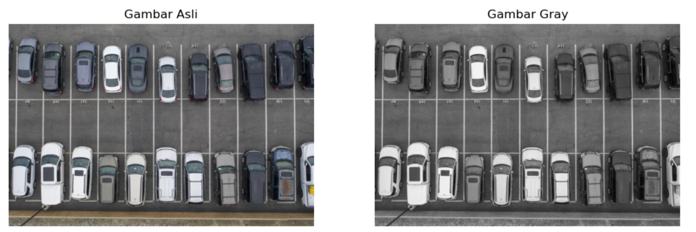
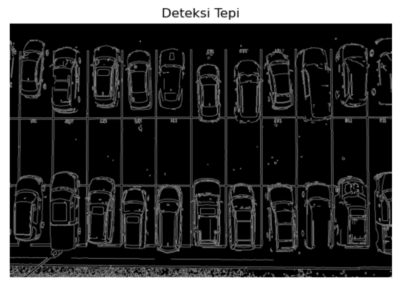
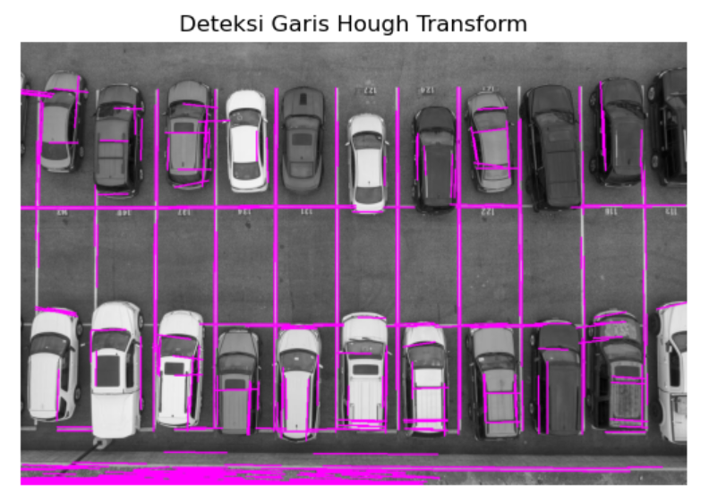
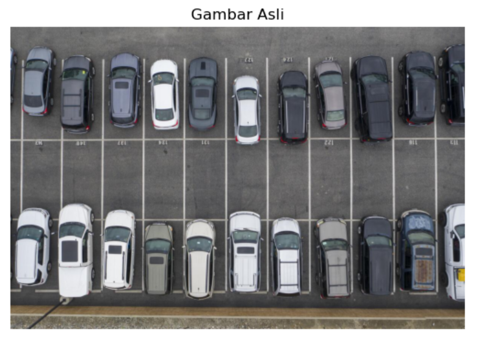
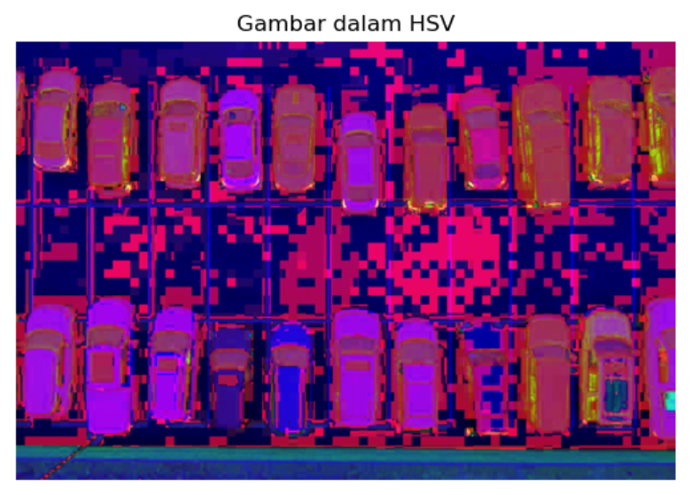
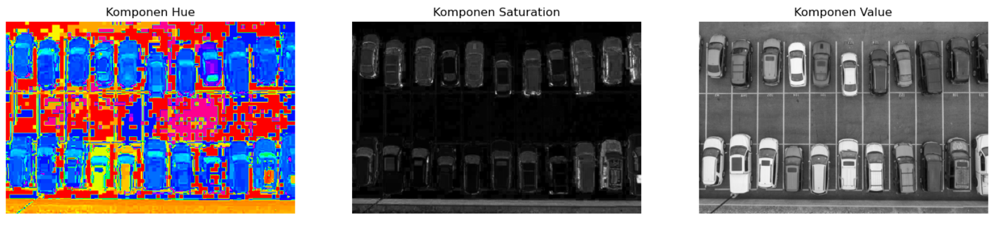

# LAPORAN PARKTIKUM 3 DAN 4
## Praktikum Tepi dan Garis Menggunakan Gambar

 - Import Library 
 ```http
import cv2
import matplotlib.pyplot as plt
import numpy as np
```

 - Membaca Gambar Dalam Format Warna Asli dan Grayscale
  ```http
image_color = cv2.imread('1.jpg')
image_gray = cv2.cvtColor(image_color, cv2.COLOR_BGR2GRAY)
```

 - Menampilkan Gambar Asli dan Grayscale
  ```http
fig, ax = plt.subplots(1, 2, figsize=(12, 6))

ax[0].imshow(cv2.cvtColor(image_color, cv2.COLOR_BGR2RGB))
ax[0].set_title('Gambar Asli')
ax[0].axis('off')

ax[1].imshow(image_gray, cmap='gray')
ax[1].set_title('Gambar Gray')
ax[1].axis('off')

plt.show()
```
Hasil Gambar


 - Melakukan Deteksi Tepi Menggunakan Algoritma Cann
  ```http
edges = cv2.Canny(image_gray, 100, 200)
```

 - Menampilkan Hasil Deteksi Tepi
  ```http
plt.imshow(edges, cmap='gray')
plt.title('Deteksi Tepi')
plt.axis('off')
plt.show()
```
Hasil Gambar


 - Melakukan Transformasi Hough Probabilistik Untuk Mendeteksi Garis
  ```http
lines = cv2.HoughLinesP(edges, 1, np.pi / 180, threshold=100, minLineLength=50, maxLineGap=10)
```

 - Membuat Salinan Gambar Untuk Menggambar Garis
  ```http
image_lines = cv2.cvtColor(image_gray, cv2.COLOR_GRAY2BGR)

for line in lines:
    x1, y1, x2, y2 = line[0]
    cv2.line(image_lines, (x1, y1), (x2, y2), (255, 0, 255), 2)
```

 - Menampilkan Hasil Deteksi Garis
  ```http
plt.imshow(cv2.cvtColor(image_lines, cv2.COLOR_BGR2RGB))
plt.title('Deteksi Garis Hough Transform')
plt.axis('off')
plt.show()
```
Hasil Gambar



## Praktikum Ekstraksi Fitur Menggunakan skimage (scikit-image) RGB to HSV

 - Memproses dan Memvisualisasikan Gambar 
  ```http
from skimage import io, color
import matplotlib.pyplot as plt
```

 - Membaca Gambar
  ```http
image_rgb = io.imread('1.jpg')
```

 - Menampilkan Gambar Asli
  ```http
plt.imshow(image_rgb)
plt.title('Gambar Asli')
plt.axis('off')
plt.show()
```
Hasil Gambar


 - Konversi dari RGB ke HSV
  ```http
image_hsv = color.rgb2hsv(image_rgb)
```

 - Menampilkan Gambar Hasil Konversi HSV
  ```http
plt.imshow(image_hsv)
plt.title('Gambar dalam HSV')
plt.axis('off')
plt.show()
```
Hasil Gambar


 - Ekstraksi Komponen HSV
  ```http
h, s, v = image_hsv[:, :, 0], image_hsv[:, :, 1], image_hsv[:, :, 2]
```

 - Menampilkan Komponen H, S, dan V
  ```http
fig, ax = plt.subplots(1, 3, figsize=(18, 6))

ax[0].imshow(h, cmap='hsv')
ax[0].set_title('Komponen Hue')
ax[0].axis('off')

ax[1].imshow(s, cmap='gray')
ax[1].set_title('Komponen Saturation')
ax[1].axis('off')

ax[2].imshow(v, cmap='gray')
ax[2].set_title('Komponen Value')
ax[2].axis('off')

plt.show()
```

Hasil Gambar



